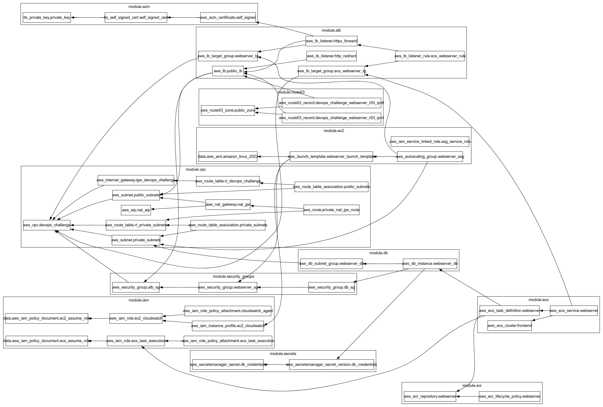

# DevOps IaC Example w/ Terraform and Ansible
This is example code for using Terraform for IaC as well as some Ansible Playbooks

## Basic Goals

### Terraform Code
This is written in a way where infrastructure is grouped into modules for easy management and reusability.
- **[./modules/\*](https://github.com/thisismygithubok/tmgm-devops-challenge/tree/main/terraform/modules)** - contains all modules needed to deploy the infra for this publicly accessible, highly secure, high-availability web service.
- **[./envs/\*](https://github.com/thisismygithubok/tmgm-devops-challenge/tree/main/terraform/envs)** - contains prod.tfvars file for deployment. Can easily add other envs.
- **[./providers.tf](https://github.com/thisismygithubok/tmgm-devops-challenge/blob/main/terraform/providers.tf)** - The AWS and TLS providers needed for these deployments.
- **[./versions.tf](https://github.com/thisismygithubok/tmgm-devops-challenge/blob/main/terraform/versions.tf)** - The required provider source/versions and terraform version.
- **[./main.tf](https://github.com/thisismygithubok/tmgm-devops-challenge/blob/main/terraform/main.tf)** - The main terraform file being applied - utilises modules for easy readability and maintenance.
- **[./variables.tf](https://github.com/thisismygithubok/tmgm-devops-challenge/blob/main/terraform/variables.tf)** - Any repeated static variables that would likely change between environments - can be "managed" via .tfvars files per environment.
- **[./locals.tf](https://github.com/thisismygithubok/tmgm-devops-challenge/blob/main/terraform/locals.tf)** - Any repeated static variables that would likely **NOT** change between environments.

### TF Modules
- **[vpc](https://github.com/thisismygithubok/tmgm-devops-challenge/tree/main/terraform/modules/vpc)** - Creates the VPC, subnets, IGW, and the private RT. This also creates NAT gateways, RTs, and assocations for the private subnets for the EC2 instances to be able to install packages and deploy the ansible playbook.
- **[security-groups](https://github.com/thisismygithubok/tmgm-devops-challenge/tree/main/terraform/modules/security-groups)** - Creates the Public, Private, and DB SGs and their respective ingress/egress rules.
- **[acm](https://github.com/thisismygithubok/tmgm-devops-challenge/tree/main/terraform/modules/acm)** - Uses TLS for generating the private key & self signed cert - import to ACM.
- **[alb](https://github.com/thisismygithubok/tmgm-devops-challenge/tree/main/terraform/modules/alb)** - Creates the public ALB, TG, and both listeners. Also creates the TG and listener rule for the ECS-based webserver.
- **[route53](https://github.com/thisismygithubok/tmgm-devops-challenge/tree/main/terraform/modules/route53)** - Creates the R53 hosted zone and both alias records.
- **[ec2](https://github.com/thisismygithubok/tmgm-devops-challenge/tree/main/terraform/modules/ec2)** - Grabs the latest AWS Linux 2023 AMI, creates a launch template and ASG, and checks for the ASG service linked role.
    - Also contains a /scripts directory which contains the install.sh script used in the launch template for ansible install, repo clone, and playbook run.
- **[iam](https://github.com/thisismygithubok/tmgm-devops-challenge/tree/main/terraform/modules/iam)** - Creates the necessary IAM role, policy, and instance profile for the webserver access logs to be piped to CloudWatch. This also creates the IAM role, policy, and policy attachment for the ECS task execution role.
- **[db](https://github.com/thisismygithubok/tmgm-devops-challenge/tree/main/terraform/modules/db)** - Creates the MariaDB instance for the webservers, as well as the required DB subnet group.
- **[secrets](https://github.com/thisismygithubok/tmgm-devops-challenge/tree/main/terraform/modules/secrets)** - Stores and handles the database credentials passed in at apply. Credentials are handled as "sensitive" throughout.
- **[ecr](https://github.com/thisismygithubok/tmgm-devops-challenge/tree/main/terraform/modules/ecr)** - Creates the ECR repo and image lifecycle policy.
- **[ecs](https://github.com/thisismygithubok/tmgm-devops-challenge/tree/main/terraform/modules/ecs)** - Creates the ECS cluster, ECS service, and accompanying task definition.

### TF Vars
- Ideally you don't have tfvars files commited for secrets - but this is commited as it doesn't contain sensitive details, uses dummy credentials, and allowed easier deployment testing. Ideally you manage these secrets in a secrets manager or the github repo, and inject them at runtime in the pipeline/action.

### Additional Info
- Profile of "terraform" was added into providers.tf as this is the aws profile I used to test my deployments.

## Additional Challenges

### 1. Ansible Config Management
This utilises ansible to install an apache httpd webserver and then deploy a basic html webpage. Accomplishing this did require extending the VPC infra to include NAT gateways and RTs for the private subnets. This is so the EC2 instances had internet access to be able to run the install.sh script, clone the repo, and deploy the ansible playbook. **I deployed this via the EC2 launch template as it seemed ideal for making sure the instance was configured properly on launch, especially during scaling events. You definitely could manage this externally using some type of cronjob and the dynamic inventory plugin.**
- **[./ansible-playbooks/\*](https://github.com/thisismygithubok/tmgm-devops-challenge/tree/main/ansible-playbooks)** - contains the ansible playbooks used to install httpd and the basic webpage, plus the playbook for the CW agent.
- **[./ansible-playbooks/files/](https://github.com/thisismygithubok/tmgm-devops-challenge/tree/main/ansible-playbooks/files)** - contains the basic index.html deployed to the httpd server, plus the CW agent config JSON.

### 2. Containerisation
This is the same concept as the webserver in EC2 - but built as a docker image, published to ECR, deployed to an ECS service, and served on the same public ALB as the EC2 instance version. Accomplishing this required creating 2 new TF modules "ecr" and "ecs" for the ECR repo, ECR lifecycle rule, ECS cluster, service, and task definition.
- **ECR** - Created the necessary ECR repo to store the container image, as well as a lifecycle policy to cleanup untagged and old images.
- **ECS** - Created the necessary ECS cluster, ECS service, and task definition needed to deploy the image from ECR. The ECS-based service, via the task definition, is passed the DB connection string required to connect to the DB (this is a dummy app, so no db connectivity actually needed/used).
- **IAM** - Created a new IAM role to be attached to the service as the task execution role to handle image pulling, etc.
- **ALB** - Created a new TG to attach to the ALB listener, as well as a listener rule to direct traffic to the ECS based webserver instead of the EC2 based webserver.

### 3. Observability - CloudWatch Logs
This utilises another ansible playbook to install, copy the desired config, and start the AWS CloudWatch agent. The CloudWatch agent pipes the httpd server access logs to streams in a CW log group. Accomplishing this required creating a new TF module "iam" for the IAM resources which include an IAM role, IAM policy, and instance profile.
- **[./ansible-playbooks/cloudwatch-agent.yml](https://github.com/thisismygithubok/tmgm-devops-challenge/blob/main/ansible-playbooks/cloudwatch-agent.yml)** - the ansible playbook for the CW agent install.
- **[./ansible-playbooks/files/aws-cloudwatch-agent.json](https://github.com/thisismygithubok/tmgm-devops-challenge/blob/main/ansible-playbooks/files/aws-cloudwatch-agent.json)** - the json config for the CW agent.

### 4. Database Integration
An RDS DB is provisioned running MariaDB. MariaDB was chosen as it has maringally better performance than MySQL, and something more complex/heavy isn't generally necessary for a simple webserver. This is only accessible to the webservers via a new DB SG, which only allows ingress from the WebServer SG. Accomplishing this required creating 2 new TF modules, "db" and "secrets" for the DB resources and for the DB credentials, as well as the new SG.
- **DB** - Created both a DB instance and the required DB subnet group. The attached SG is a new DB SG which only allows ingress from the WebServer SG.
- **Secrets** - Utilises AWS Secrets Manager for both the DB username and password. These strings are marked sensitive throughout, and the only exposure is on input. This could be remedied by injecting at runtime from an external secret manager like Hashicorp Vault, GitHub repo secrets, etc.

## Terraform Deployment Diagram & Dependencies
Terraform provides a neat little graph that can be visualised when using the command "terraform graph". This was drawn with [GraphvizOnline](https://dreampuf.github.io/GraphvizOnline)

